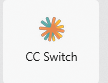
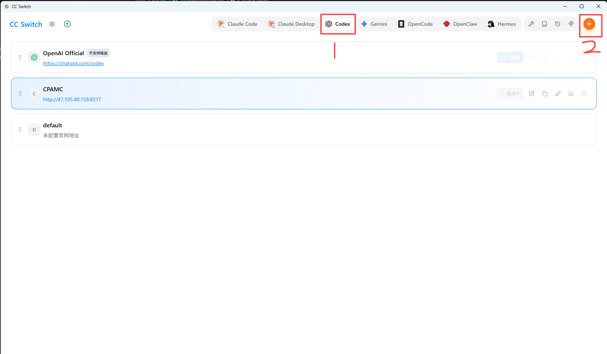
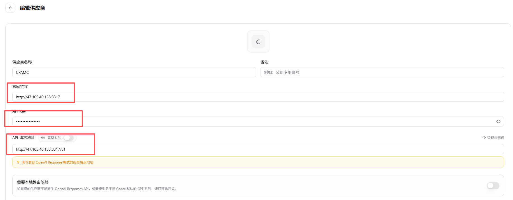

# 2026.6.5 更新

::: tip 更新说明
目前官方 Codex 的插件功能已经可以直接使用，后续不再需要额外安装 Codex++。
:::

## 变化说明

之前如果通过 API 方式打开 Codex，界面里的「插件」部分是灰色不可用的，所以我们才需要安装 Codex++。

不过昨天晚上我看推上有人说，官方已经把这个插件功能修复了。我今天早上试了一下，确实已经可用。

目前还不确定之前是 bug，还是官方有意调整。总之，现在直接使用官方 Codex 就可以，不需要再额外安装 Codex++。

## 现在怎么配置

第一步还是先下载官方codex https://openai.com/zh-Hans-CN/codex/?ref=niceshare.site

装好以后只剩一件事：修改配置文件，配置我们的 API 地址和 Key。

这里建议大家使用另一款工具：`cc-switch`。

这款工具界面更简洁，使用的人也更多，并且支持的编程工具更多。

下载地址：https://cc-switch.cc/

## 配置步骤

安装完成后，按下面的方式配置：

配置完成后，点击「确定」即可。
